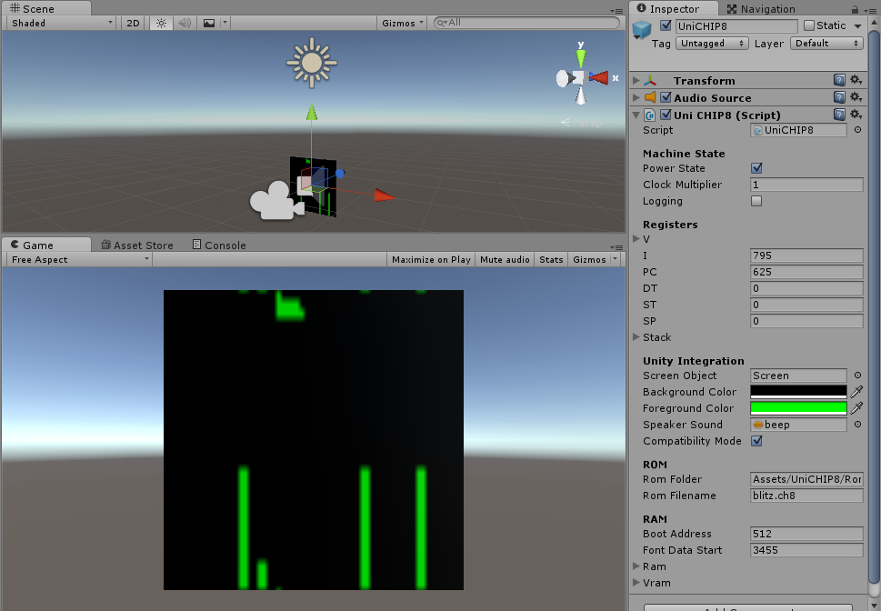

# UniCHIP8

A CHIP-8 implementation for Unity 3D, based on Laurence Muller's tutorial, "[How to write an emulator (CHIP-8 interpreter)](http://www.multigesture.net/articles/how-to-write-an-emulator-chip-8-interpreter/)"

## Creating a basic CHIP-8 virtual machine

First, import [the UniCHIP asset package](PackageBuild/UniCHIP8.unitypackage) into your project.

### Getting started

1. Drag a UniCHIP8 prefab from the prefabs folder into your scene.
1. Optionally, type in the name of a ROM file located in the Roms folder
1. Ensure the UniCHIP8's Power State property is checked
1. Position the camera near the quad so it takes up most of the view
1. Press Play in the Unity Editor

#### Creating a basic UniCHIP8 prefab

1. Create a quad named Screen
1. Assign the UniCHIP8Screen material to it
1. Create an empty GameObject named UniCHIP8
1. Add the UniCHIP8 component to the UniCHIP8 GameObject
1. Assign your Screen quad to the UniCHIP8's Screen Object property
1. Optionally, assign the beep sound to the UniCHIP8's Speaker Sound property
1. Optionally, type in the name of a ROM file located in the Roms folder
1. Ensure the UniCHIP8's Power State property is checked
1. Position the camera near the quad so it takes up most of the view
1. Press Play in the Unity Editor

## Interacting with Unity

UniCHIP8 offers a number of custom opcodes to interact with your scenes.

To enable UniCHIP8 Extensions:

1. Disable the Compatibility Mode property on your UniCHIP8 instance
1. Add a UniCHIP8 Router from the prefabs folder
1. Assign it to the Router property on your UniCHIP8 instance

To make the UniCHIP8 aware of other GameObjects in a scene, they must have the UniCHIP8Node component on them and have a UniCHIP8Router assigned.

## UniCHIP8 Opcode Summary

    Misc
      test              call              broadcast
      send              reparent          destroy

    Transform
      move              rotate            scale
      moveX             rotateX           scaleX
      moveY             rotateY           scaleY
      moveZ             rotateZ           scaleZ
	  lookAt

    Create
      create            createCube        createSphere
      createCylinder    createCapsule     createPlane
      createQuad        createEmpty       createDirectionalLight
	  createPointLight  createSpotLight

    Materials
      addMaterial       setMaterialColor
	  
	Lights
	  setLightColor     setLightIntensity

    Machine state
      clockMultiplier   logging           compatiblityMode
      pause             halt              powerDown

See the [UniCHIP8 wiki](https://github.com/psema4/unichip8/wiki) for more information.
   
## License

UniCHIP8 is made available under the MIT license. See [LICENSE.md](LICENSE.md) for additional details.
  
### Other

The default UniCHIP8 system beep sound is modified from beep-6 in ["Interface beeps"](https://opengameart.org/content/interface-beeps)
